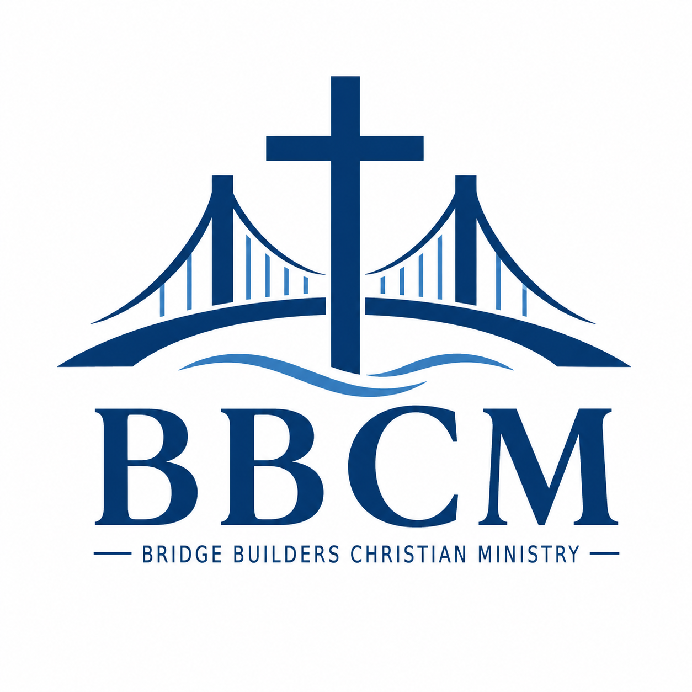

# Church Membership Census System

Static web app for managing church membership census records for Bridge Builder's Christian Ministries.

## Files

- `index.html` - app layout and screens
- `registration.html` - public-only mobile registration form
- `styles.css` - visual design, responsive layout, dark mode, and print styles
- `app.js` - records, validation, localStorage, CSV import/export, reports, and printing
- `registration.js` - public registration form validation and localStorage submission
- `server.js` - optional local static server for opening the app through localhost
- `package.json` - npm start command for the local static server

## How To Open

Recommended: open the app through localhost.

```bash
npm start
```

Then open:

```text
http://localhost:8080
```

This only runs a local static file server. It does not add a backend, database, or server-side saving.

You can also open `index.html` directly in a browser as a fallback, but localhost is better for browser features such as print windows, downloads, and optional file saving.

## Admin Password

The main admin app at `index.html` has a browser-side password lock.

Default first-time password:

```text
admin123
```

After logging in, go to **Settings > Admin Access** and change the password.

Important: this is a static website, so the password is only a client-side access lock to prevent casual viewing. For strong authentication across users and devices, the app would need a backend server with real login accounts.

Use **Lock** in the top bar to hide the admin app again.

## Public Registration Form

The app includes a separate public registration page:

```text
http://localhost:8080/registration.html
```

This page is mobile-friendly and only shows the registration form. It does not show the dashboard, members table, individual profiles, reports, import/export tools, or settings.

You can also open or copy the public form link from **Settings > Public Registration Form**.

Important static-site limitation:

- If the public form is submitted on the same browser and same localhost origin, the record appears in the admin app.
- If the public form is shared to another phone or computer, that device stores its own local copy in its own browser.
- A backend or hosted form collection service is required if you want submissions from other devices to automatically appear in one central admin record list.

### Mobile Access

The public registration form is responsive and can be opened on mobile. If you want another device on the same network to open it, run the server on your network interface:

```bash
$env:HOST="0.0.0.0"; npm start
```

Then use your computer's local network IP address from the phone, for example:

```text
http://192.168.1.25:8080/registration.html
```

The exact IP address depends on your network.

### Change The Localhost Port

The default port is `8080`. To use another port:

```bash
$env:PORT=3000; npm start
```

Then open:

```text
http://localhost:3000
```

If port `8080` is already in use, the server will automatically try the next available port, such as `8081` or `8082`. Check the terminal output for the exact URL.

To stop the local server, press `Ctrl + C` in the terminal where `npm start` is running.

### No NPM Option

If you do not want to use `npm`, run Node directly:

```bash
node server.js
```

Recommended browsers:

- Google Chrome
- Microsoft Edge
- Firefox

Chrome and Edge may also support the optional File System Access API for browser-based file saving. If that feature is unavailable, the app falls back to regular CSV downloads.

## Important Data Warning

This is a static website. It cannot save directly to a server-side CSV file or database.

Records are saved in the browser's `localStorage`, which means:

- Data is saved only in the current browser and device.
- Clearing browser data can delete the census records.
- Using another browser or computer will not show the same records.
- Regular CSV backups are required to avoid data loss.

Use **Backup Now** or **Import / Export > Export full_backup.csv** regularly.

## Basic Workflow

1. Open `index.html`.
2. Go to **Register Member**.
3. Fill in the required member details.
4. Add household or family members if needed.
5. Check the data privacy consent box.
6. Choose one of the save options:
   - **Save Record**
   - **Save and Add Another**
   - **Save and View Profile**
7. Use **Members Table** to search, filter, sort, view, edit, delete, print, or export records.
8. Use **Dashboard** and **Reports** for summaries and printable reports.
9. Export CSV backups regularly.

## Required Fields

The registration form requires:

- Full Name
- Complete Address
- City
- Province
- Mobile Number
- Birthday
- Gender
- Membership Status
- Date Joined / First Visit Date
- Data Privacy Consent

The app validates mobile number format, email format, future birthdays, and duplicate records using Full Name + Birthday + Mobile Number.

## Family Members

Inside the registration form, use **Add Family Member** to add household members such as:

- Church member spouse
- Non-member spouse
- Children
- Parents
- Relatives
- Other household members

Family members can be marked as church members or non-members. If they already have their own member record, use the Linked Member ID field.

## CSV Export

Available exports include:

- All member records: `members.csv`
- Selected records from the table
- Visible filtered records from the table
- Individual member profile CSV
- Family members: `family_members.csv`
- Household summary: `households.csv`
- Full backup: `full_backup.csv`
- Dashboard summary: `dashboard_summary.csv`
- Generated reports

CSV files are Excel-friendly and escape commas, quotes, and line breaks.

## CSV Import

Go to **Import / Export** and choose:

- A members CSV or full backup CSV
- Optionally, a separate `family_members.csv`

Then click **Import CSV**.

The import process validates columns, skips duplicates, and shows:

- Total rows found
- Records imported
- Rows skipped
- Duplicates found
- Errors found

Duplicates are detected using Member ID and Full Name + Birthday + Mobile Number.

## Reports

The Reports section can generate:

- Total Membership Report
- Active Members Report
- Inactive Members Report
- Visitors Report
- Regular Attendees Report
- Gender Summary Report
- Age Group Summary Report
- Household / Family Summary Report
- Birthday Celebrants Report
- Wedding Anniversary Report
- Ministry Involvement Report
- New Members / First-Time Visitors Report
- Members with Missing Information Report

Reports can be filtered, exported to CSV, printed, or saved as PDF through the browser print dialog.

## Printing And PDF

Use the print buttons in:

- Dashboard
- Individual View
- Reports

To save as PDF, choose **Print**, then select **Save as PDF** in the browser print dialog.

## Settings

The Settings section includes:

- Church name setting
- Logo placeholder information
- Dark mode toggle
- Compact table mode toggle
- Export all data
- Import backup shortcut
- Clear all data

Use **Clear All Data** carefully. It removes all saved census records from the current browser.

## Replacing The Logo Placeholder

The app currently displays a clean "Church Logo" placeholder. To replace it later, edit the logo placeholder area in `index.html` and insert an image element, for example:

```html

```

Place the image file beside `index.html` or update the `src` path to match your folder structure.

## Troubleshooting

If records disappear:

- Confirm you are using the same browser and device.
- Check whether browser data was cleared.
- Import the latest `full_backup.csv`.

If CSV import fails:

- Confirm the file is a CSV file.
- Check that required columns are present.
- Use an exported `full_backup.csv` as the safest import format.

If print output looks different:

- Enable background graphics in the browser print settings when needed.
- Use Save as PDF from the print dialog for a PDF copy.
